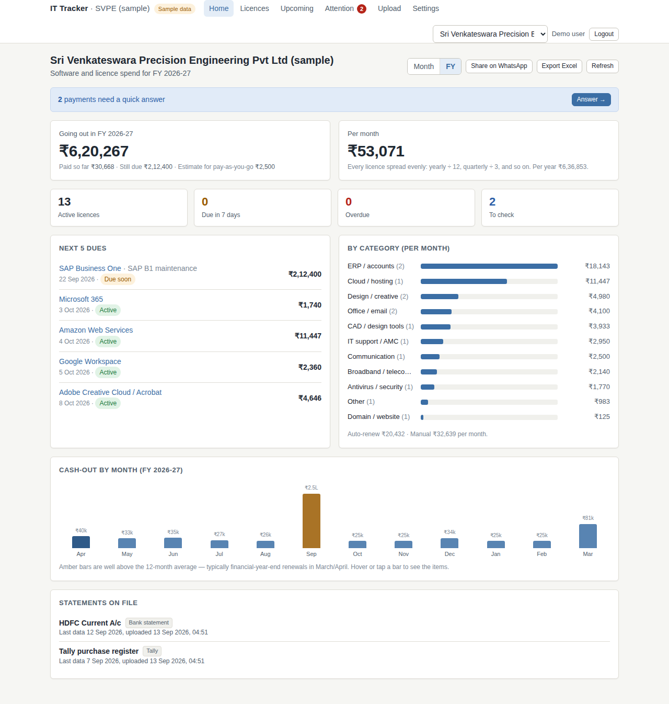

# IT Spend Tracker

**One screen that shows a small factory every software licence and subscription it pays for — what goes out this month, what is due next — and reminds the owner on WhatsApp before a renewal lapses.**

Built for Indian MSMEs and manufacturing units (20–300 staff) who pay for SolidWorks, AutoCAD, Tally, Microsoft 365, SAP B1 AMC, antivirus, cloud, domains… through a mix of resellers, NEFT, cards and UPI, and today have no single view of it.

Nothing is installed at the customer. They upload the files they already have (bank statement Excel, Tally purchase register); the engine does the rest.

```
messy payments in  →  one engine  →  one clean list + due dates + WhatsApp reminders
```

<p align="center">
  
</p>

## Quick start (Docker — 2 minutes)

```bash
git clone https://github.com/fwddeploy/IT_Spend_Tracker.git
cd IT_Spend_Tracker
docker compose up --build
```

Open <http://localhost:8000> and log in with the demo account:

```
demo@ittracker.local / demo1234
```

A sample factory with 24 months of bank data and a Tally register is already loaded, so every screen is full. Register your own user from the login page to start a fresh company.

## Quick start (local development)

```bash
# backend — Python 3.11+. SQLite by default; set DATABASE_URL for Postgres (see .env.example)
cd backend
pip install -r requirements.txt
uvicorn app.main:app --reload --port 8000

# frontend — Node 20+ (dev server proxies /api to :8000)
cd frontend
npm install
npm run dev            # http://localhost:5173
npm run build          # -> frontend/dist, which the backend serves at :8000
```

Run the tests (107, on SQLite; the same suite runs on Postgres):

```bash
cd backend && python -m pytest -q
```

## What it does

| You do | It does |
|---|---|
| Upload a bank statement (Excel / CSV / PDF) or a Tally purchase register (Excel / XML) | Detects the bank and the columns, drops non-IT lines (salary, raw material, GST, bank charges) |
| Nothing else | Recognises the vendor behind each payment — even through resellers ("Shree Infotech ₹5,310" = Tally TSS) and payment gateways |
| | Merges the same bill seen in bank + Tally, understanding GST, TDS, forex markup, refunds, split payments |
| | Finds what repeats: monthly / quarterly / yearly / 3-yearly / prepaid credits, with next due date and a confidence score |
| Answer a short question only when it really can't tell | Learns the answer for next time |
| Glance at Home | "Going out this month" and "monthly-equivalent" side by side, next dues, 12-month cash-out, FY view |
| Set owner's WhatsApp / email in Settings | Reminders go out before every due date; overdue lines get a weekly nudge |

More screens: [needs-attention inbox](docs/screenshots/attention.png) · [settings & reminders](docs/screenshots/settings-reminders.png) · [phone](docs/screenshots/phone.png)

## How it works (one paragraph)

Every uploaded line becomes a **raw row**. The engine cleans the narration into a payee name (`NEFT-N0001-SHREE INFOTECH-TSS` → `SHREE INFOTECH`), looks the payee up in a vendor dictionary (aliases, reseller list, known list prices, narration words, answers the user gave before), merges duplicates across sources into **payments**, groups repeating payments into **lines** (one per licence/subscription) with a cycle, expected amount, next due and status, and raises a **question** only for what it cannot resolve. User edits are kept across re-runs. Read [docs/ARCHITECTURE.md](docs/ARCHITECTURE.md) for the full picture.

## Project layout

```
backend/            FastAPI + SQLAlchemy (Postgres in prod, SQLite in dev)
  app/engine/       the engine: normalize → vendors → dedupe → recurrence → status; runner.py orchestrates
  app/parsers/      bank statement / Tally readers (Excel, CSV, PDF, XML) with column auto-detection
  app/data/vendors.yaml   vendor dictionary — edit this to teach it new vendors, resellers, list prices
  app/api/          routes + schemas;  app/auth.py  login/roles;  app/reminders.py  WhatsApp/email job
  alembic/          migrations (Postgres);  tests/  107 tests;  samples/  the sample files
frontend/           Vite + React + TypeScript: Home, Licences, Upcoming, Attention, Upload, Settings
docs/               ARCHITECTURE.md · DEVELOPMENT.md · API.md · ROADMAP.md · research/ · history/
CLAUDE.md           context for AI coding assistants (Claude Code reads it automatically)
docker-compose.yml  app + Postgres
```

## Configuration

Copy `.env.example` to `.env` in the project root. Both `docker compose` and `uvicorn` read it automatically. Everything is optional except in production:

| Variable | What it is |
|---|---|
| `DATABASE_URL` | Postgres URL. Unset → local SQLite file. |
| `SECRET_KEY` | Signs login cookies. Set a long random string in production. |
| `SEED_SAMPLE` | `1` (default) loads the sample factory on an empty database; `0` starts empty. |
| `WA_PHONE_NUMBER_ID`, `WA_TOKEN`, `WA_TEMPLATE_NAME` | WhatsApp Cloud API (Meta) for reminders. Unset → reminders are logged as "not set up". |
| `SMTP_HOST`, `SMTP_PORT`, `SMTP_USER`, `SMTP_PASS`, `SMTP_FROM` | Email reminders. |
| `APP_ACCESS_KEY` | Optional extra key for scripts (`X-Access-Key` header) besides login. |
| `SCHEDULER` | `0` disables the hourly reminder job (tests). |

## Documentation

- [docs/ARCHITECTURE.md](docs/ARCHITECTURE.md) — data flow, models, every engine rule, status maths, auth, reminders.
- [docs/DEVELOPMENT.md](docs/DEVELOPMENT.md) — set-up, tests, how to add a vendor / a bank format / a route, migrations, deploy checklist.
- [docs/API.md](docs/API.md) — every endpoint with request/response shapes.
- [docs/ROADMAP.md](docs/ROADMAP.md) — what's next (email intake, WhatsApp bill photos, GST portal, Zoho/M365 connectors).
- [docs/research/](docs/research/) — the market, integration and engine-logic research the design is based on.
- [docs/history/](docs/history/) — the original build plan, review reports and status notes.

## Status

v0.2 — a working product for pilots: login and roles, uploads, engine, dashboard, reminders, export, audit log. See [docs/history/STATUS-v0.2.md](docs/history/STATUS-v0.2.md). Licence: private, © Fwddeploy.
